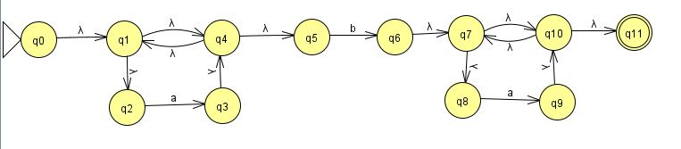

# Rust Program autómata finito determinista.
#### Institución: Universidad Politécnica de San Luis Potosí
#### Alumno: Yesenia America Morales Diaz de Leon
#### Matricula: 170151
#### Carrera: Ingeniería en Tecnologías de la Información
#### Materia: Teoría Computacional
#### Profesor: Juan Carlos González Ibarra
#### Objetivo:  Validar una cadena. Programar un autómata finito  no deterministico capaz de decidir si es o no una cadena valida para la expresion regular a evaluar que es a*ba*.
#### Lenguaje: Rust
#### Repositorio: https://github.com/upslp-teoriacomputacional/170151

Para este programa se desarrollo un automata finito no deterministico para validar la expresion regular a*.b.a*. Para realizar esto se  utiliza una biblioteca que nos ayuda a manejar expresiones regulares. Al momento de utilizar esta libreria nos pide realizar el programa como un proyecto por lo que el codigo fuente se ubica en afd_170151/src/main.rs.

El programa te pide ingresar una cadena para evaluar, la valida con la tabla de estados, te muestra la tabla de estados correspondiente a la cadena ingresada y te dice si es valida o no.

Nuestro AFN seria el siguiente:



## Como se soluciono el problema 
Para manejar expresiones regulares en rust se utilizo la biblioteca Regex, que es una biblioteca de Rust para analizar, compilar y ejecutar expresiones regulares. Su sintaxis es similar a las expresiones regulares de estilo Perl, pero carece de algunas características como mirar alrededor y referencias inversas. A cambio, todas las búsquedas se ejecutan en tiempo lineal con respecto al tamaño de la expresión regular y el texto de búsqueda.
Se representa como una secuencia de instrucciones de código de bytes (dinámica) o como una función especializada de Rust (nativa). Se puede utilizar para buscar, dividir o reemplazar texto.
Otras librerias que se ocuparon fueron la de procesos y para ingresar datos por teclado.

Para utilizar la libreria Regex necesitamos mencionarla en nuestro Cargo.toml.
```
[package]
name = "afd_170151"
version = "0.1.0"
authors = ["Yesenia Morales <170151@upslp.edu.mx>"]
edition = "2018"

# See more keys and their definitions at https://doc.rust-lang.org/cargo/reference/manifest.html

[dependencies]
regex = "1.3.9"
```
Y despues en nuestra cabecera del programa colocamos las librerias de la siguiente manera:

```rust
extern crate regex; //Libreria que nos ayuda a analizar
//compilar y ejecutar expresiones regualres
use regex::Regex;  // Libreria de expresiones regulares
use std::process;  //Para procesos
use std::io;      //Para entrada de datos por teclado
```
Ahora, con esto podemos definir nuestras expresiones validas 
```rust
let a = Regex::new(r"a").unwrap();
let b = Regex::new(r"b").unwrap();
```
Para poder validar nuestros caracteres ingresados, primero necesitamos hacer una conversion a String para que Rust pueda realizar la comparación.
```rust
//Conversion para comparar caracter
let mut c= String::from("");
c.push(character);
let carac: &str = &c[..];
```
Entonces ahora si podremos comparar si es a, b, la cadena esta vacia o contiene algo diferente
```rust
if a.is_match(carac)
{
    return 1;       //a
}
else if b.is_match(carac) 
{
    return 2;       //b
}
else if carac==fin
{
    return 0;       //Fin de cadena, ya esta vacia
}else{
    return 3;       //Caracter no valido
}  
```

Nuestra expresion regular quedaria definida formalmente como:
E(r)=a*.b.a*
Alfabeto={ϵ, a, b}
Q={q0,q1,q2,q3,q4,q5,q6,q7,q8,q9,q10,q11}
q0={q0}
qf={q11}

En nuestra funcion principal crearemos una tabla para la tabla de transiciones. La cual es:
<pre>
|Estado	|     ε    |    a    |    b   | Fin de cadena |
|  q0   |   q1	   |  Error  |  Error | Error         |
|  q1	|   q2,q4  |  Error  |  Error | Error         |
|  q2	|  Error   |   q3    |  Error | Error         |
|  q3	|   q4	   |  Error  |  Error | Error         |
|  q4	|   q5,q1  |  Error  |  Error | Error         |
|  q5	|  Error   |  Error  |   q6   | Error         |
|  q6	|   q7	   |  Error  |  Error | Error         |
|  q7	|   q8,q10 |  Error  |  Error | Error         |
|  q8	|  Error   |   q9    |  Error | Error         |
|  q9	|   q10	   |  Error  |  Error | Error         |
|  q10	|   q11,q7 |  Error  |  Error | Error         |
|  q11	|  Error   |  Error  |  Error | Aceptacion    |
</pre>

Entonces nuestra tabla de transiciones seria:
<pre>
| 1  |  E |  E |  E |
| 2  |  E |  E |  E |
| E  |  3 |  E |  E |
| 4  |  E |  E |  E |
| 5  |  E |  E |  E |
| E  |  E |  6 |  E |
| 7  |  E |  E |  E |
| 8  |  E |  E |  E |
| E  |  9 |  E |  E |
| 10 |  E |  E |  E |
| 11 |  E |  E |  E |
| E  |  E |  E |  A |
</pre>
Los estados que tienen dos salidas se programara para saber si necesita ir a su segunda salidas de la siguiente manera:

```rust
//Si el caracter es b y el estado es 1 se va hacia su segunda salida que es 4
if character == 'b' && estado ==1 
{
    estado=4;
} //Si el caracter es a y su estado esta en 4 regresamos al estado 1
else if character == 'a' && estado ==4
{
    estado=1;
} //Si el caracter es a y el estado 10, regresamos al estado 7
else if character == 'a' && estado == 10
{
    estado=7;
} //Si el caracter esta en vacio despues de b, se dirige a el estado 10
else if character == '\r' && estado == 7
{
    estado=10;
}
```
Para nuestra tabla de transiciones del automata AFN como no acepta el 10 y 11 se utilizan las letras D y O, que en codigo ascii serian 68 y 79.

```rust
//Esta es la tabla de transiciones del automata AFN creado
let tabla: Vec<Vec<char>>;
    tabla = vec![ 
                // ε   A   B   Fin
            vec! ['1','E','E','E'],     
            vec! ['2','E','E','E'],     
            vec! ['E','3','E','E'],     
            vec! ['4','E','E','E'],     
            vec! ['5','E','E','E'],     
            vec! ['E','E','6','E'],    
            vec! ['7','E','E','E'],     
            vec! ['8','E','E','E'],     
            vec! ['E','9','E','E'],     
            vec! ['D','E','E','E'],     
            vec! ['O','E','E','E'],     
            vec! ['E','E','E','A']      
            //10='D' 68, 11='O' 79
    ];
```
Para leer nuestra cadena desde teclado

```rust
let mut cadena = String::new();     //Declarar variable
io::stdin().read_line(&mut cadena); //Leer la cadena desde el teclado
```

Ahora con un ciclo for in vamos validando caracter por caracter para ir recorriendo el automata

```rust
for  character in cadena.chars(){
    //Codigo
}
```

Como tenemos salidas que dan a vacio, haremos un arreglo en nuestro ciclo for, donde validaremos los estados que van a vacio.
```rust
 while estado == 0 || estado == 1 || estado == 3 || estado == 4 || estado == 6 || estado == 7 || estado == 9 || estado == 10 
{
    let mut estadosig: i32=estado;
    //Verificamos si hay que tomar la segunda salida de los estados que tienen dos salidas.
    //Si el caracter es b y el estado es 1 se va hacia su segunda salida que es 4
    if character == 'b' && estado ==1 
    {
        estado=4;
    } //Si el caracter es a y su estado esta en 4 regresamos al estado 1
    else if character == 'a' && estado ==4
    {
        estado=1;
    } //Si el caracter es a y el estado 10, regresamos al estado 7
    else if character == 'a' && estado == 10
    {
        estado=7;
    } //Si el caracter esta en vacio despues de b, se dirige a el estado 10
    else if character == '\r' && estado == 7
    {
        estado=10;
    }else 
    {    //Si no se cumple ninguna de esas caracteristicas avanza de estado.
        estadosig=estado; 
        newcaracter = 0; // La columna que debe tomar en la tabla es la 0 por que tenemos una transicion vacia
        if estado==9
        { // Si el estado es igual a 9, asignamos a estado 10, debido al arreglo que tenemos en la tabla
            estado=10;
        }else if estado==10
        { //Y hacemos lo mismo con el estado 10
            estado=11;
        }else{ //Si no pues avanzamos de estado normal, tomando los valores de nuestra tabla
            estado=(tabla[ estado as usize][newcaracter as usize])as i32 -48 ;
        }
    }
    contenido(estadosig,' ',"     ",estado);
    
} 
```

Enotnces nuestro ciclo for quedaria de la siguiente manera:
```rust
for  character in cadena.chars(){
    //Ciclo while
    //llamamos al metodo para saber si es un caracter valido y el valor retornado se guarda en charcaracter
    let mut newcaracter= caracter(character);
    //guardamos en estado el valor obtenido en la tabla segun las cordenadas que recibio anteriormente
    estado=(tabla[ estado as usize][newcaracter as usize])as i32 -48 ;
    if newcaracter == 1
    {
        simbolo = "  a  ".to_string();
    }else if newcaracter == 2
    {
        simbolo = "  b  ".to_string();
    }
    //Ciclos if para validar si cadena es valida o no
}
```

Al final si el valor obtenido en estado es una E imprimimos cadena no valida, si el estado no es 11 que es el de aceptacion imprimimos cadena no valida y si el estado es 11 es una cadena de aceptacion
Si ingresamos una cadena valida nuestro resultado seria el siguiente:
<pre>
+-------------------------------------+
|    Ingrese una cadena a evaluar:    |
+-------------------------------------+
abaa
+--------------+---------+-----------+---------------+
| Edo. Actual  |Caracter | Simbolo   |Edo. Siguiente |
+--------------+---------+-----------+---------------+
|     0        |         |           |     1         |
+--------------+---------+-----------+---------------+
|     1        |         |           |     2         |
+--------------+---------+-----------+---------------+
|     2        |   a     |     a     |     3         |
+--------------+---------+-----------+---------------+
|     3        |         |           |     4         |
+--------------+---------+-----------+---------------+
|     4        |         |           |     5         |
+--------------+---------+-----------+---------------+
|     5        |   b     |     b     |     6         |
+--------------+---------+-----------+---------------+
|     6        |         |           |     7         |
+--------------+---------+-----------+---------------+
|     7        |         |           |     8         |
+--------------+---------+-----------+---------------+
|     8        |   a     |     a     |     9         |
+--------------+---------+-----------+---------------+
|     9        |         |           |     10        |
+--------------+---------+-----------+---------------+
|     10       |         |           |     7         |
+--------------+---------+-----------+---------------+
|     7        |         |           |     8         |
+--------------+---------+-----------+---------------+
|     8        |   a     |     a     |     9         |
+--------------+---------+-----------+---------------+
|     9        |         |           |     10        |
+--------------+---------+-----------+---------------+
|     10       |         |           |     11        |
+--------------+---------+-----------+---------------+
|     11       |         | Fin Cadena |              |
+--------------+---------+-----------+---------------+
|                    Cadena Valida                   |
+----------------------------------------------------+
</pre>
