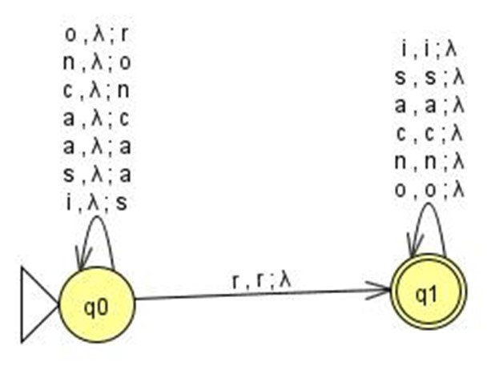
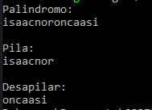
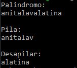

# Rust program that validates a palindrome
#### Institución: Universidad Politécnica de San Luis Potosí
#### Alumno: Yesenia America Morales Diaz de Leon
#### Matricula: 170151
#### Carrera: Ingeniería en Tecnologías de la Información
#### Materia: Teoría Computacional
#### Profesor: Juan Carlos González Ibarra
#### Objetivo:  Validar una palindromo
#### Lenguaje: Rust
#### Repositorio: https://github.com/upslp-teoriacomputacional/170151

Para este programa se desarrollo un programa que valideun palindromo. Para realizar esto se realizo un automata de pila. Al momento de utilizar una libreria nos pide realizar el programa como un proyecto por lo que el codigo fuente se ubica en pila_170151/src/main.rs.

## Como se soluciono el problema 
Para realizar el programa se utiliza un automata de pila, un automata de pila es es un modelo matemático de un sistema que recibe una cadena constituida por símbolos de un alfabeto y determina si esa cadena pertenece al lenguaje que el autómata reconoce. El lenguaje que reconoce un autómata con pila pertenece al grupo de los lenguajes libres de contexto en la clasificación de la Jerarquía de Chomsky.

Para solucionar el problema se penso en una pila.

El palindromo de ejemplo: Isaac no ronca así.
Se obtiene el tamaño de la cadena. Se guarda en un pila la mitad de la cadena mas uno.Se utiliza una pila para poder sacar el ultimo elemento que se metió y cumplir con la característica de el palíndromo.
Nuestro palíndromo de ejemplo seria:

<pre>
[I,s,a,a,c,n,o,r]
</pre>

El tamaño de nuestra cadena es: 15
El tamaño de nuestra pila es: (15/2)+1=8
Conforme vamos guardando los datos los imprimimos hasta que llegamos al final de nuestra pila, entonces empezamos a sacar los datos de la pila y se imprimen. Así tendremos nuestro palíndromo completo.
Entonces en ejecución, nuestro programa seria:

<pre>
Impresión Pantalla    Pila
I                     [I]
S                     [I,S]
A                     [I,S,A]
A                     [I,S,A,A]
C                     [I,S,A,A,C]
N                     [I,S,A,A,C,N]
O                     [I,S,A,A,C,N,O]
R                     [I,S,A,A,C,N,O,R]
O                     [I,S,A,A,C,N]
N                     [I,S,A,A,C]
C                     [I,S,A,A]
A                     [I,S,A]
A                     [I,S]
S                     [I]
I                     [ ]
</pre>

Entonces se diseña el automata de pila que seria el siguiente:



Para la programacion utilizaremos la libreria para leer desde teclado.

```rust
use std::io;      //Para entrada de datos por teclado
```

Y programamos nuestras variables

```rust
let mut cadena = String::new();     //Declarar variable cadena
io::stdin().read_line(&mut cadena); //Leer la cadena desde el teclado
let mut num = cadena.len();         //Obtiene tamaño de la cadena
let mut tamPila = (num/2);          //Calcula el tamaño de la pila
let mut w1: Vec<char> = Vec::new(); //Crea la pila
let cadenaP: &str = &cadena[..tamPila]; //Obtiene solamente la cadena que se guardara en la pila
```

Guardamos los valores de la cadena((n/2)+1) en nuestra pila, que ya obtuvimos con nuestra variable de cadenaP imprimiendo el valor que estamos guardando.

```rust
for chars in cadenaP.chars() //Guarda los datos en la pila
    {
        w1.push(chars);
        print!("{}",chars);
    }
```
Ahora desapilamos el elemento de enmedio de nuestro palindromo

```rust
w1.pop(); //Desapila el valor de enmedio 
```

Y desapilamos lo restante de la pila imprimiendo el valor.

```rust
    while let Some(top) = w1.pop() { //Desapila los restantes valores 
        print!("{}", top);
    }
```
Entonces nuestra salida seria la siguiente:



Y jala con otros palindromos de la misma manera:


